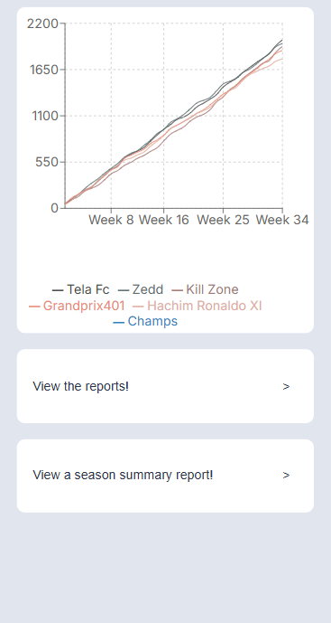
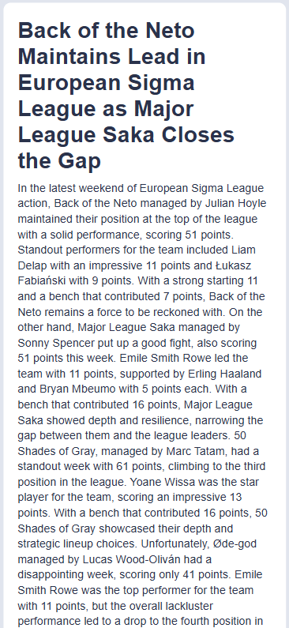

# Fantasy Football News Site



LLM-generated weekly news reports for a Fantasy Premier League mini-league. Pulls live data from the public FPL API, formats it into a structured prompt, and asks an LLM to write a news-style report — complete with a snarky headline, callouts of standout (and abject) performances, and the occasional inside joke.

A standings line graph and a season-summary report round it out.



## Features

- **Weekly reports** — auto-generated headline + body covering each manager's gameweek, captain choices, and bench decisions.
- **Season summary** — collapses every week into one end-of-season retrospective.
- **Standings graph** — cumulative points per team across the season, rendered with Recharts.
- **Caching** — completed gameweek reports are persisted in Firestore so the LLM only runs once per week.

## Architecture

```
┌──────────────┐      ┌──────────────────┐      ┌───────────────┐
│  Next.js 14  │ ───▶ │  FastAPI backend │ ───▶ │  FPL public   │
│  (frontend)  │      │  (Cloud Run)     │      │  API          │
└──────────────┘      └────────┬─────────┘      └───────────────┘
                               │
                       ┌───────┴────────┐
                       ▼                ▼
                 ┌───────────┐    ┌───────────┐
                 │ Firestore │    │  OpenAI   │
                 │  (cache)  │    │   API     │
                 └───────────┘    └───────────┘
```

- **Backend** — FastAPI + LangChain + Pydantic. Fetches league standings and per-manager picks from the FPL API, formats them into a structured prompt, and calls OpenAI via `langchain-openai`. Completed weeks are cached in Firestore; in-progress weeks are regenerated on every request.
- **Frontend** — Next.js 14 (App Router) + TypeScript + Recharts. Three routes: `/` (standings graph + nav), `/report` (list of weekly reports), `/report/[id]` (single report), and `/summary` (season retrospective).
- **Deployment** — both services are containerised and intended for Cloud Run, with Firestore as the persistence layer.

## Project structure

```
backend/
├── main.py                       # FastAPI routes
├── requirements.txt
├── backend.dockerfile
└── football_reports/
    ├── datasources/
    │   ├── fpl.py                # FPL API client
    │   └── firestore.py          # Cache layer
    ├── formatter.py              # Prompt assembly
    ├── generator.py              # LangChain + OpenAI
    ├── prompts.py                # Prompt templates
    ├── report_utils.py           # Orchestration
    └── models/                   # Pydantic schemas

frontend/
├── src/app/
│   ├── page.tsx                  # Home (graph + nav)
│   ├── report/                   # Weekly reports
│   ├── summary/                  # Season summary
│   ├── components/
│   └── styles/
├── package.json
├── next.config.mjs
└── frontend.dockerfile
```

## Getting started

### Prerequisites

- Python 3.10+
- Node.js 18+
- An OpenAI API key
- A Google Cloud project with Firestore enabled, plus a service account with Firestore access

### 1. Configure environment

Copy the example file and fill in your values:

```bash
cp .env.example backend/.env
cp .env.example frontend/.env.local
```

| Variable | Where | What it is |
|---|---|---|
| `OPENAI_API_KEY` | backend | Used by `langchain-openai` for report generation. |
| `GOOGLE_APPLICATION_CREDENTIALS` | backend | Path to a Firestore-enabled service account key. |
| `NEXT_PUBLIC_REPORT_GENERATOR_URL` | frontend | URL of the running backend (e.g. `http://localhost:8080`). |

You'll also need to set your league ID. It's currently hardcoded in `backend/football_reports/datasources/fpl.py` — see the **Known issues** section below.

### 2. Run the backend

```bash
cd backend
python -m venv .venv && source .venv/bin/activate
pip install -r requirements.txt
uvicorn main:app --reload --port 8080
```

### 3. Run the frontend

```bash
cd frontend
npm install
npm run dev
```

Open http://localhost:3000.

## API endpoints

| Method | Path | Purpose |
|---|---|---|
| `GET` | `/` | Current gameweek's report (cached if the week is complete). |
| `GET` | `/report/{gw_id}` | Report for a specific gameweek. |
| `GET` | `/reports` | All weekly reports for the season; back-fills missing weeks on demand. |
| `GET` | `/summary` | Season-summary report generated from all weekly reports. |
| `GET` | `/teams/history` | Per-team cumulative points across all completed gameweeks. |

## Deployment

Both services are designed for Cloud Run:

```bash
# Backend
gcloud run deploy fantasy-backend \
  --source backend/ \
  --set-env-vars OPENAI_API_KEY=...

# Frontend
gcloud run deploy fantasy-frontend \
  --source frontend/ \
  --set-env-vars NEXT_PUBLIC_REPORT_GENERATOR_URL=https://...
```

The frontend Dockerfile takes `NEXT_PUBLIC_REPORT_GENERATOR_URL` as a build arg, so it must be set at build time, not just runtime.

## Known issues / roadmap

- **League ID is hardcoded** in `FPLClient.__init__`. Should be read from an env var.

## License

MIT — see [LICENSE](LICENSE).